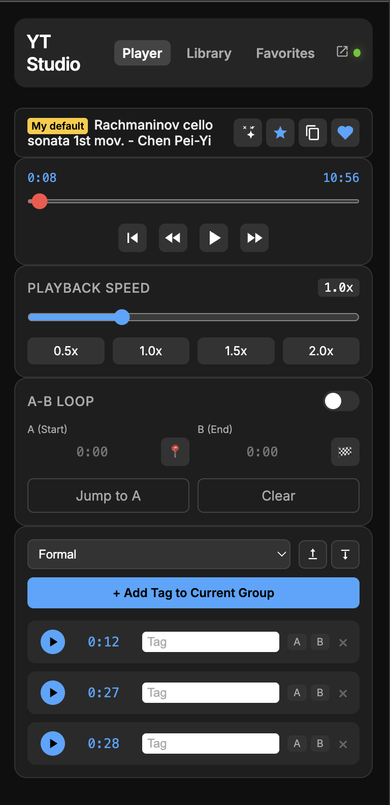
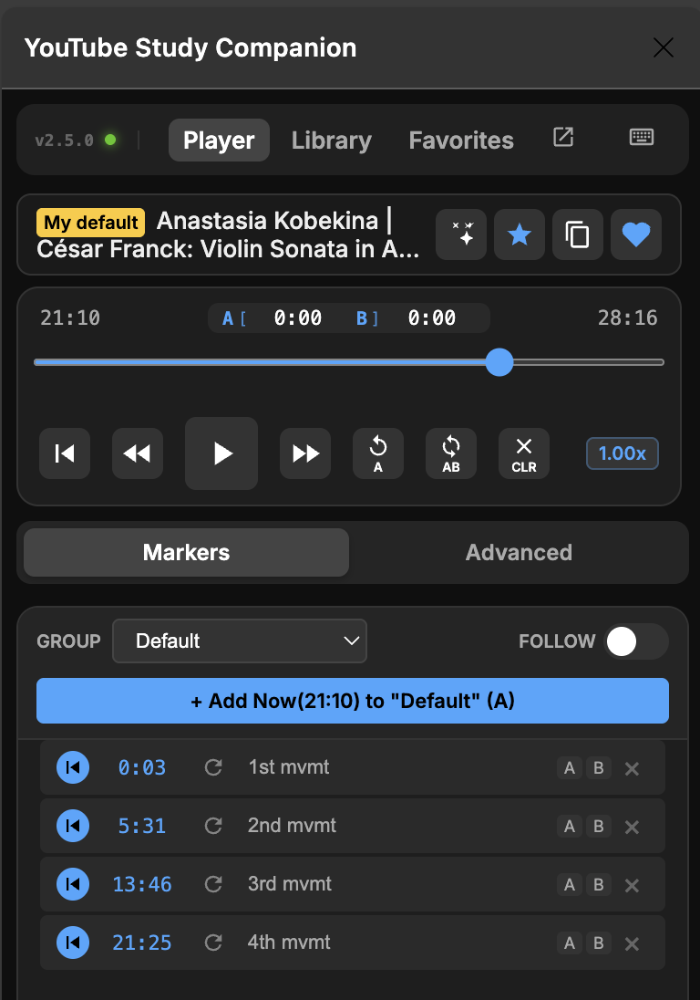
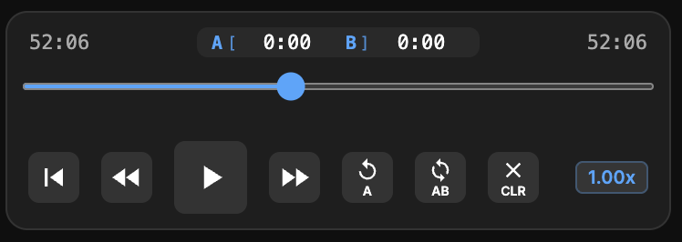
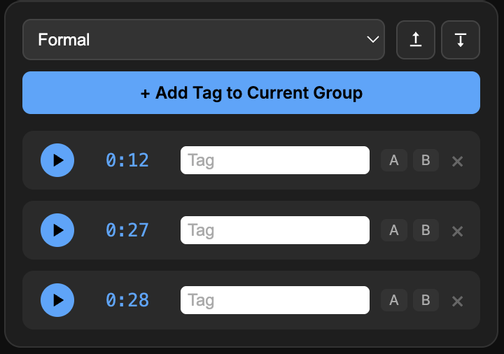
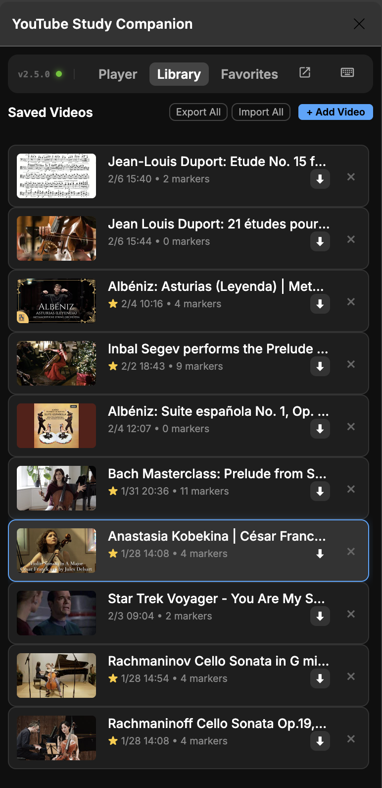

[English](USER_MANUAL.md) | [繁體中文](USER_MANUAL.zh-TW.md)

# User Manual: YouTube Studio Sidebar

Welcome to YouTube Studio Sidebar! This guide will help you familiarize yourself with all features of this extension, giving you a more powerful learning and control experience on YouTube.

**Tip**: For the best reading experience, it is recommended to take screenshots of the actual operation interface and replace the image placeholders in this text.

---

## 📖 Table of Contents

1.  [Interface Overview](#1-interface-overview)
2.  [Player Controls](#2-player-controls)
3.  [A-B Loop](#3-a-b-loop)
4.  [Smart Markers](#4-smart-markers)
5.  [Library & Profiles](#5-library--profiles)
6.  [Pop-out Window](#6-pop-out-window)
7.  [Keyboard Shortcuts](#7-keyboard-shortcuts)

---

## 1. Interface Overview

After launching the Extension, you will see the main screen. The sidebar is designed simply, mainly divided into three tabs:

*   **Player**: The main operation area. It now features two internal sub-tabs:
    *   **Markers**: Your primary workspace for taking and browsing notes.
    *   **Controls**: Adjustment area for Speed and A-B Loop.
*   **Library**: View the history of all videos for which you have saved profiles.
*   **Favorites**: Quick access to your frequently used profiles marked as "Star/Default".

*(Suggested Screenshot: Full screen after opening Sidebar)*

On the right side of the top title bar is a **↗️ Arrow Button**. Click to detach the window (Pop-out). 

### 🟢 Status Indicator
Next to the **v2.0** badge, you will see a small circular indicator:
- **Green**: Extension is actively connected to the YouTube video.
- **Grey**: extension is in Standby mode (saving resources).

---

## 2. Player Controls

At the top of the Player tab, you have full control over video playback.

*(Suggested Screenshot: Upper part of Player tab, including progress bar and play buttons)*

### Feature Explanation:

*   **Video Status**: Displays the currently detected video title.
    *   **Auto Detect (🪄)**: If no video is detected, click this button to redetect.
    *   **Save/Heart (❤️)**: Click the heart icon to save the current video settings (markers, loop points) to the library.
*   **Transport Controls**:
    *   **Restart**: Return to video start.
    *   **-10s / +10s**: Fast rewind or fast forward 10 seconds.
    *   **Play/Pause**: Large central Play/Pause button.
*   **Playback Speed**:
    *   **Collapsible Area**: Click the "Playback Speed" header or chevron to expand/collapse.
    *   **Slider**: Drag slider to finely adjust speed from 0.25x to 3.0x.
    *   **Presets**: Quick buttons (0.5x, 1.0x, 1.5x, 2.0x).

---

## 3. A-B Loop

Designed for language learning or instrument practice, allowing you to repeat specific segments.

*(Suggested Screenshot: A-B Loop area)*

1.  **Expand Section**: Click the "A-B Loop" header to see the controls.
2.  **Set Start (A)**: Play to where you want to start, click the `S` button.
3.  **Set End (B)**: Play to where you want to end, click the `E` button.
4.  **Enable Loop**: Turn on the toggle switch in the header, video will repeat infinitely between A and B.
4.  **Fine Tune**: You can directly modify the time in the input box (format mm:ss).

---

## 4. Smart Markers

Marker function allows you to take notes on the video timeline and jump back at any time.

*(Suggested Screenshot: Markers area, including several created markers)*

*   **Add Marker**: Click `+ Add "Now" to Current Marker Group` to create a marker at the current time.
*   **Follow Playback**: Toggle the "Follow" switch to auto-scroll the list to the current marker. This setting is **permanently saved** to your profile.
*   **Group Management (Groups)**:
    *   Select group via dropdown menu (e.g., `Default`, `Study`).
    *   Notes of different natures can be stored separately.
*   **Click to Jump**: Click on a marker in the list, video will immediately jump to that timestamp.
*   **Import/Export**: Use the download/upload icons at the top to back up your marker data (JSON format).

---

## 5. Library & Profiles

This is a powerful feature allowing you to save multiple different "learning contexts" for the **same video**.

*(Suggested Screenshot: Library tab)*

### What is a "Video Profile"?
When you click the heart icon `❤️` in the title bar, you are actually saving a "Profile". You can save multiple times for the same video, for example:
*   First save: Focus on "Vocabulary Notes".
*   Second save: Focus on "Grammar Analysis".

### Operation:
*   **Library Tab**: Lists all saved videos.
*   **Favorites Tab**: Shows only profiles you have marked with a "Star".
*   **Clone Session**: In the Player page, click `Clone` button to copy the current profile and create a new version.
*   **Set as Default**: Set a profile as the "Default" for that video; this setting loads automatically next time you open the video.

---

## 7. Keyboard Shortcuts

YouTube Studio Sidebar supports a wide range of keyboard shortcuts. Click the **Keyboard Icon (⌨️)** in the title bar to toggle the on-screen guide.

### Basic Controls
*   **Space / K**: Play / Pause.
*   **J / L**: Rewind / Forward (10s).
*   **, / .**: Frame back / forward (When paused).
*   **0-9**: Jump to percentage of video (0%–90%).
*   **M**: Mute / Unmute.
*   **F**: Fullscreen.

### Advanced Looping
*   **`[`**: Set Point A.
*   **`]`**: Set Point B.
*   **`{` (Shift+[)**: Jump to Start A.
*   **`}` (Shift+])**: Toggle A-B Loop.

### Markers & Navigation
*   **A**: Add a new marker at current time.
*   **S**: Toggle "Follow Playback" mode.
*   **↑ / ↓**: Navigate sequentially through markers (automatically seeks and disables Follow mode for manual browsing).

---

> **Note**: All data for this extension is stored in your browser's local storage (Local Storage). Please regularly use the export function to back up important data.
