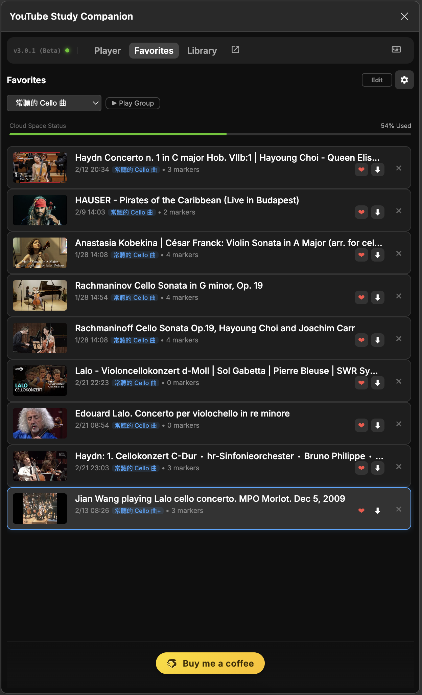
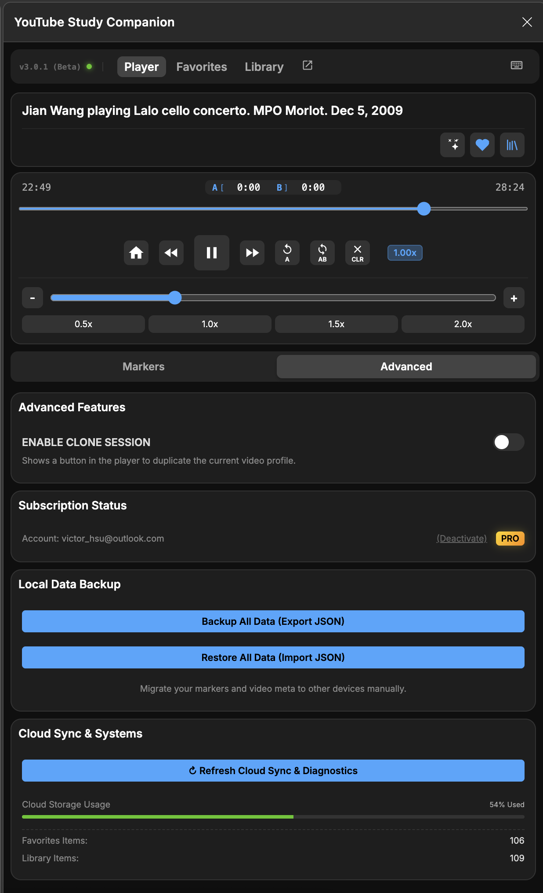
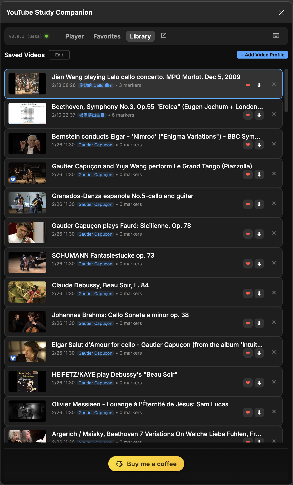

[English](USER_MANUAL.md) | [繁體中文](USER_MANUAL.zh-TW.md)

# User Manual: YouTube Study Companion

Welcome to YouTube Study Companion! This guide will help you familiarize yourself with all features of this extension, giving you a more powerful learning and control experience on YouTube.

**Tip**: For the best reading experience, it is recommended to take screenshots of the actual operation interface and replace the image placeholders in this text.

---

## 📖 Table of Contents

1.  [Interface Overview](#1-interface-overview)
2.  [Player Controls](#2-player-controls)
3.  [A-B Loop](#3-a-b-loop)
4.  [Smart Markers](#4-smart-markers)
5.  [Library & Favorites](#5-library--favorites)
6.  [Pop-out Window](#6-pop-out-window)
7.  [Keyboard Shortcuts](#7-keyboard-shortcuts)
8.  [Cross-Device Synchronization](#8-cross-device-synchronization)

---

## 1. Interface Overview

After launching the Extension, you will see the main screen. The sidebar is designed simply, mainly divided into three tabs:

*   **Player**: The main operation area. It now features two internal sub-tabs:
    *   **Markers**: Your primary workspace for taking and browsing notes.
    *   **Advanced**: Adjustment area for Speed, Cloud Sync Refresh, and **Pro Account Activation**.
*   **Library**: View history of saved sessions. Free users are limited to **10 saved videos** here.
*   **Favorites**: Quick access to starred/default sessions.

*(Suggested Screenshot: Full screen after opening Sidebar)*

On the right side of the top title bar is a **↗️ Arrow Button**. Click to detach the window (Pop-out). 

### 🟢 Status Indicator
Next to the **v3.0.0** badge, you will see a status indicator:
- **Green**: Extension is actively connected to the YouTube video.
- **Grey**: Extension is in Standby mode.
- **[New] Group Play Banner**: A green banner appears at the top when Group Play mode is active.
- **[New] Mode Border**: The whole player panel highlights with a green border during playlist playback.
- **[New] Color-coded Title Highlight**: 
    - **Amber Title**: Indicates the video is on a hidden tab in the current window.
    - **Blue Title**: Indicates the video is in a different window (Pop-out or Dual Monitor mode).

---

## 2. Pro Features & Cloud Verification

YouTube Study Companion now supports cloud-linked account binding.

1.  **Auto Identification**: The system automatically detects the Google account logged into your Chrome browser.
2.  **Unlocking**: Go to **Player -> Advanced**, click **Activate Pro Features**, and enter the Code provided by the author.
3.  **Sync Persistence**: Once activated, your Pro status is stored in the cloud. It will automatically be recognized on any computer where you are logged into the same Google account.
4.  **Free Version Limits**:
    *   Library capped at 10 saved videos.
    *   Marker groups capped at 10 markers per group.
    *   Locked videos in the Library appear dimmed and unclickable until you upgrade.

---

## 3. Player Controls

At the top of the Player tab, you have full control over video playback.

*(Suggested Screenshot: Upper part of Player tab, including progress bar and play buttons)*

### Feature Explanation:

*   **Video Status**: Displays the currently detected video title.
    *   **Auto Detect (🪄)**: If no video is detected, click this button to redetect.
    *   **Save/Heart (❤️)**: Click the heart icon to save the current video settings (markers, loop points) to the library.
*   **Transport Controls**:
    *   **Restart**: Return to video start.
    *   **-10s / +10s**: Fast rewind or fast forward 10 seconds.
    *   **Play/Pause**: Large central Play/Pause button.
*   **Playback Speed**:
    *   **Collapsible Area**: Click the "Playback Speed" header or chevron to expand/collapse.
    *   **Slider**: Drag slider to finely adjust speed from 0.25x to 3.0x.
    *   **Presets**: Quick buttons (0.5x, 1.0x, 1.5x, 2.0x).

---

## 3. A-B Loop

Designed for language learning or instrument practice, allowing you to repeat specific segments.

*(Suggested Screenshot: A-B Loop area)*

1.  **Expand Section**: Click the "A-B Loop" header to see the controls.
2.  **Set Start (A)**: Play to where you want to start, click the `S` button.
3.  **Set End (B)**: Play to where you want to end, click the `E` button.
4.  **Enable Loop**: Turn on the toggle switch in the header, video will repeat infinitely between A and B.
4.  **Fine Tune**: You can directly modify the time in the input box (format mm:ss).

---

## 4. Smart Markers

Marker function allows you to take notes on the video timeline and jump back at any time.

*(Suggested Screenshot: Markers area, including several created markers)*

*   **Add Marker**: Click `+ Add Marker (A)` to create a marker at the current time.
*   **Follow Playback**: Toggle the "Follow" switch to auto-scroll the list to the current marker.
*   **Group Management (Groups)**:
    *   Select group via dropdown menu (e.g., `Default`, `Study`).
*   **[New] Hotkey R**: Press **`R`** to instantly restart the most recently active marker.
*   **Import/Export**: Use the icons in the title bar to back up your data (JSON format).

---

## 5. Group Play & Playlists (New in v3.0)

Group Play allows you to treat a Favorite Group as a sequential playlist.

### How to use:
1.  **Start Group Play**: Go to the **Favorites** tab, select a folder, and click **▶ Play Group**.
2.  **Navigation**: The interface transitions into "Playlist Mode" with a green header. Use the **Prev/Next** buttons (visible only in this mode) to switch videos.
3.  **Automatic Next**: When a video ends, the next one in the group will load automatically.
4.  **Integrated Scraper**: 
    *   Open a YouTube Playlist page.
    *   Go to **Favorites -> Manage Groups (Gear icon)**.
    *   Click **Detect & Import YouTube Playlist**.
    *   The extension will scrape all titles/IDs and create a new group for you.

---

## 5. Library & Favorites

This is a powerful feature allowing you to save multiple different "learning contexts" for the **same video**.

*(Suggested Screenshot: Library tab)*

### What is a "Video Favorite"?
When you click the heart icon `❤️` in the title bar, you are actually saving a "Favorite". You can save multiple times for the same video, for example:
*   First save: Focus on "Vocabulary Notes".
*   Second save: Focus on "Grammar Analysis".

### Operation:
*   **Library Tab**: Lists all saved videos.
*   **Favorites Tab**: Shows only favorites you have marked with a "Star".
*   **[New] Batch Management**: In Edit mode, select multiple items to delete them at once or move them to a different group collectively.
*   **[New] Numerical Index Sorting**: Precisely reorder your items within a group by entering the target index number in the sort field.
*   **Clone Session**: In the Player page, click `Clone` button to copy the current favorite and create a new version.
*   **Set as Default**: Set a favorite as the "Default" for that video; this setting loads automatically next time you open the video.

---

## 7. Keyboard Shortcuts
> [!TIP]
> **Pro Tip**: For the smoothest experience, we strongly recommend using **Keyboard Shortcuts** instead of mouse-clicking the UI. This significantly speeds up your workflow and reduces potential anomalies caused by UI rendering or click delays.

YouTube Study Companion supports a wide range of keyboard shortcuts. Click the **Keyboard Icon (⌨️)** in the title bar to toggle the on-screen guide.

### Basic Controls
*   **Space / K**: Play / Pause.
*   **J / L**: Rewind / Forward (10s).
*   **, / .**: Frame back / forward (When paused).
*   **0-9**: Jump to percentage of video (0%–90%).
*   **M**: Mute / Unmute.
*   **F**: Fullscreen.

### Advanced Looping
*   **`[`**: Set Point A.
*   **`]`**: Set Point B.
*   **`{` (Shift+[)**: Jump to Start A.
*   **`}` (Shift+])**: Toggle A-B Loop.

### Markers & Navigation
*   **A**: Add a new marker at current time.
*   **S**: Toggle "Follow Playback" mode.
*   **R**: Restart the active marker.
*   **Alt+[ / Alt+]**: Prev / Next Video (Only in Group Play mode).
*   **↑ / ↓**: Navigate sequentially through markers.

---

## 8. Cross-Device Synchronization
Your settings, bookmarks, and notes are automatically synchronized across all your computers where you use Google Chrome.

**How to enable:**
1.  Sign in to Chrome with the same Google Account on both devices.
2.  Go to `chrome://settings/syncSetup`.
3.  Ensure that **Extensions** is enabled in the "Manage what you sync" section.
4.  The extension will automatically sync your data in the background.

### ⚠️ Manual Sync Enablement (For Developer Mode)
As the extension is not yet published, to sync between different computers, you need to fix your "Extension ID". Please generate your own key through the browser:
1. Compress the project folder into a `.zip` file.
2. Go to the [Chrome Developer Dashboard](https://chrome.google.com/webstore/devconsole) (Login with Google account).
3. Click "Add new item" and upload your `.zip` file (**Note: You only need to upload; no $5 fee or actual publishing is required**).
4. Once uploaded, navigate to the "Package" tab in the left menu for that item.
5. Click "View public key" to see a long string.
6. Copy this string and paste it into the `"key": "..."` field of your local `manifest.json`.
7. Now, when you load the project on any computer, the ID will remain consistent, and auto-sync will work correctly.

---

> **Note**: While syncing is automatic, it is recommended to use the export function regularly to back up critical data (JSON).
